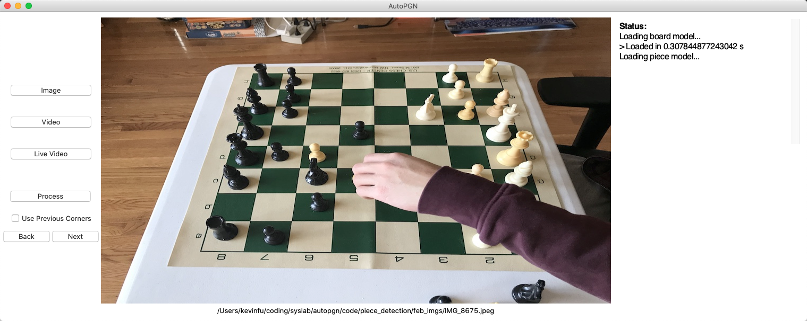

# AutoPGN

AutoPGN is an automatic chess-move transcriber. It notates the moves played in a prerecorded chess game, in real-time, using computer vision and machine learning, then outputs a PGN file that can be copy-pasted into other chess software. It also updates a graphical representation of the board as it runs.

Paper: https://drive.google.com/file/d/12eamkGZ2owfkUtRWU2UreRRwwqyMmgmF/view?usp=sharing

Live Demo: https://youtu.be/WzbYgsyceso

[ADD GIF HERE]

## Getting Started

### Dependencies

AutoPGN is written in Python 3. To run the main methods (listed under ["Running AutoPGN"](#running-autopgn)), install the following packages:
 - NumPy 1.17+
 - OpenCV 4.1+ (Homebrew installation recommended for Mac users)
 - scikit-learn 0.20+
 - Matplotlib 3.0+
 - TensorFlow 2.0+
 - tkinter 8.5+ (often pre-installed with Python)

For automatic model downloading, install:
 - gsutil 4.48+

Some of the scripts in this repo are not vital to the main method (e.g. model training scripts, data collection utilities). To run every script in this repo, install these additional packages:
 - Jupyter 4.4+

### Downloading Models

After installing the desired dependencies, clone this repo, and `cd` into `code/`. Then, to download the necessary Keras models to `models/` automatically, run:
```
chmod +x download_models.sh
./download_models.sh
```

Alternatively, manually install the necessary models by clicking the links below to download, then moving the downloaded files into `code/models/`. *Do not change any filenames.*
 - [Lattice Point CNN Structure](https://storage.googleapis.com/autopgn-assets/models/lattice_points_model.h5)
 - [Lattice Point CNN Values](https://storage.googleapis.com/autopgn-assets/models/lattice_points_model.json)
 - [Piece Classification CNN](https://storage.googleapis.com/autopgn-assets/models/piece_detection_model.h5) (>650 MB)

**Optional:** Download the lattice point dataset [here](ADD LINK HERE) and the piece classification dataset [here](https://storage.googleapis.com/autopgn-assets/new_may_dataset.zip).

### Running AutoPGN

There are a few ways to run AutoPGN. For the full video-to-PGN system, as shown in the [live demo](https://youtu.be/WzbYgsyceso), use `board_detection/video_handler.py`. Output PGN files will be saved to `board_detection/` and match filenames with the input video. From this repo, enter:
```
cd code/board_detection/
python video_handler.py src_video|phone_ip [show process] [save dir]
```


For a GUI-based version with no move transcription, use `user_interface/ui.py`. Intermediate debug images are saved to `user_interface/assets/`. Run the following:
```
cd code/user_interface/
python ui.py
```



To play around with the system, use `piece_detection/main_shell.py`. This script is the least polished, but allows the user to add OpenCV `imshow` statements, unlike the previous two options.
```
cd code/piece_detection/
python main_shell.py phone_ip models_dir input_img_path
```

## Code Overview:

```bash
code/
├── assets/
├── board_detection/
    └── video_handler.py
├── chess_logic/
├── download_models.sh
├── models/
├── piece_detection/
└── user_interface/
```

`assets/`
 - Input images for the GUI in `user_interface/`

`board_detection/`
 - Hough transform-based board detection
 - Board segmentation code
 - Lattice point CNN train script

`board_detection/video_handler.py`
 - Main method: takes video of chess game as input, outputs .pgn file
 - To save calm frames & board corners, fill optional `save_dir/` arg (for data collection)
 - Usage: `python video_handler.py src_video|phone_ip [show process] [save dir]`

`chess_logic/`
 - PGN move transcription engine
 - Sample I/O .pgn files

`download_models.sh`
 - Script to download lattice point CNN and piece detection CNN to `models/` from GCloud
 - Requires installation of gsutil

`models/`
 - Directory to house model files

`piece_detection/`
 - Piece detection CNN train scripts
 - Data augmentation utility scripts
 - Data collection utils
 - Command-line video handler

`user_interface/`
 - GUI (output debug images saved to `user_interface/assets`)
 - Query script for graphical chessboard representation
 - Deprecated wifi-camera based input scripts (requires installation of [IPCamera](https://apps.apple.com/us/app/ipcamera-high-end-networkcam/id570912928) on iPhone)
