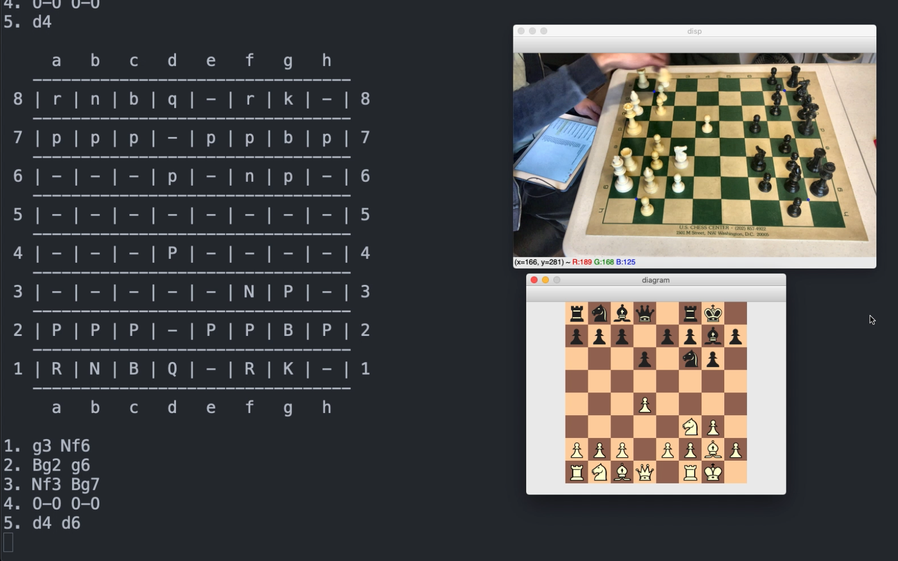

# AutoPGN

AutoPGN is an automatic chess-move transcriber. It notates the moves played in a prerecorded chess game, in real-time, using computer vision and machine learning, then outputs a PGN file that can be copy-pasted into other chess software. It also updates a graphical representation of the board as it runs.



Paper: https://drive.google.com/file/d/12eamkGZ2owfkUtRWU2UreRRwwqyMmgmF/view?usp=sharing

Live Demo: https://youtu.be/WzbYgsyceso

## Code Overview:

```bash
code/
├── assets/
├── board_detection/
    └── video_handler.py
├── chess_logic/
├── download_models.sh
├── models/
├── piece_detection/
└── user_interface/
```

`assets/`
 - Input images for the image-based UI in `user_interface/`

`board_detection/` 
 - Hough transform-based board detection
 - Board segmentation code
 - Lattice point CNN train script 

`board_detection/video_handler.py`
 - Main method: takes video of chess game as input, outputs .pgn file
 - Option to save calm frames & board corners to save_dir/ arg (used for data collection)
 - Usage: `video_handler.py src_video|phone_ip [show process] [save dir]`

`chess_logic/`
 - PGN move transcription engine
 - Sample I/O .pgn files

`download_models.sh`
 - Script to download lattice point CNN and piece detection CNN to `models/` from GCloud
 - Requires installation of gsutil

`models/`
 - Directory to house model files 

`piece_detection/`
 - Piece detection CNN train scripts
 - Data augmentation utility scripts
 - Data collection utils 
 - Command-line video handler

`user_interface/`
 - Image-based UI (output debug images saved to `user_interface/assets`)
 - Query script for graphical chessboard representation
 - Deprecated wifi-camera based input scripts (requires installation of [IPCamera](https://apps.apple.com/us/app/ipcamera-high-end-networkcam/id570912928) on iPhone) 

## Getting Started

### Dependencies

AutoPGN is written in Python 3. To run the main transcription method, found in `board_detection/video_handler.py`, install the following packages:
 - NumPy 1.17+
 - OpenCV 4.1+ (Homebrew recommended for Mac users)
 - scikit-learn 0.20+
 - Matplotlib 3.0+
 - TensorFlow 2.0+
 - tkinter 8.5+ (often pre-installed with Python)

For automatic model downloading, install:
 - gsutil 4.48+

Some of the scripts in this repo are not vital to the main method (e.g. model training scripts, data collection utilities). To run every script in this repo, install these additional packages:
 - Jupyter 4.4+

### Running AutoPGN

After installing the desired dependencies, clone this repo, and `cd` into it. Then download the necessary Keras models. This can be done automatically with gs_util by running:
```
./code/download_models.sh
```
You can also manually install the models by...

[TODO]

There are a few ways to run AutoPGN. For the full video-to-PGN system, as shown in the [live demo](https://youtu.be/WzbYgsyceso), use `board_detection/video_handler.py`. PGN files will be saved to `board_detection/` and will match filenames with the input video.
```
cd code/board_detection/
python video_handler.py src_video|phone_ip [show process] [save dir]
```

For a GUI-based, single frame system, use `user_interface/ui.py`. Intermediate debug images are saved to `user_interface/assets/`.
```
cd code/user_interface/
python ui.py
```

To play around with the system, use `piece_detection/main_shell.py`. This script is the least polished, but allows the user to add OpenCV `imshow` statements, unlike the previous two options.
```
cd code/piece_detection/
python main_shell.py phone_ip models_dir input_img_path
```

## Sample Output:

Board detection:

